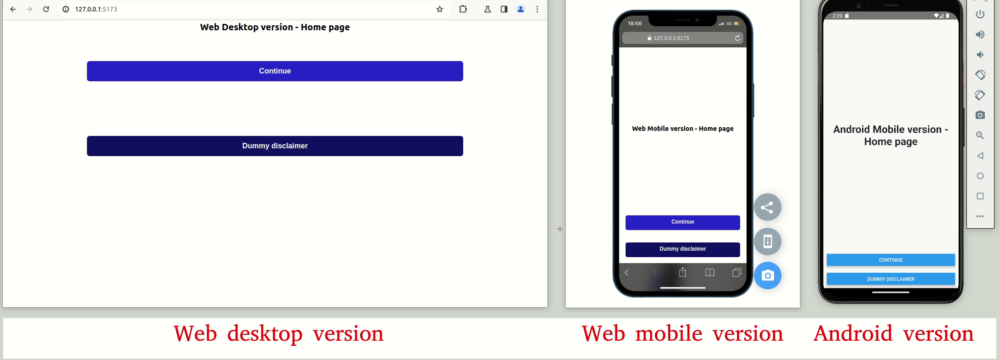
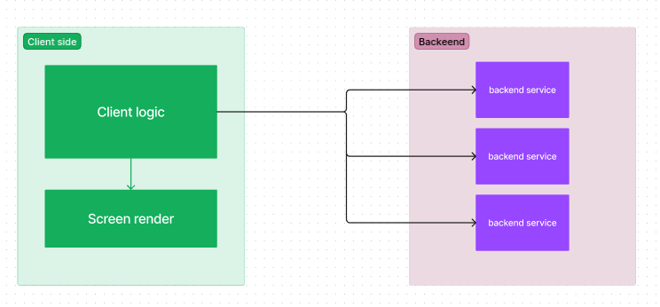
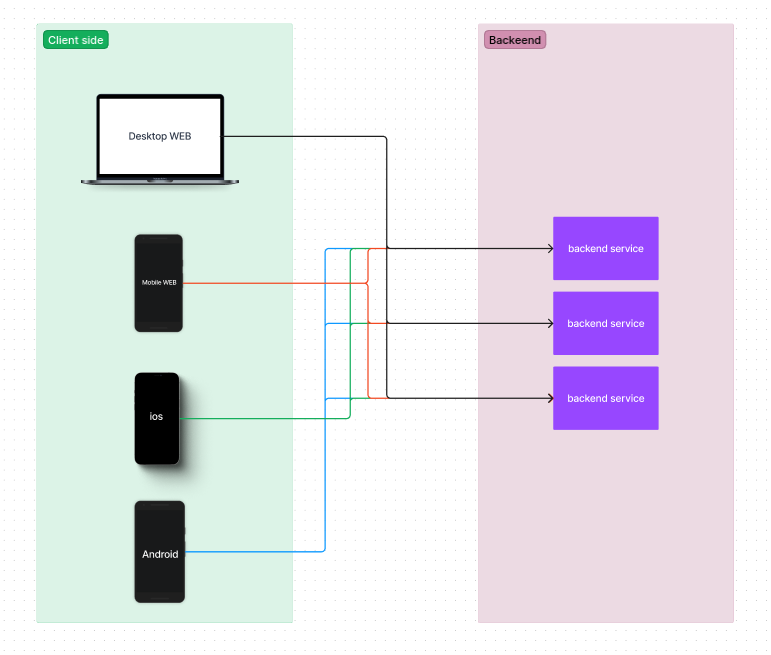
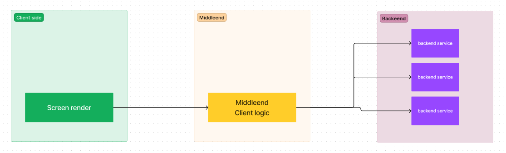
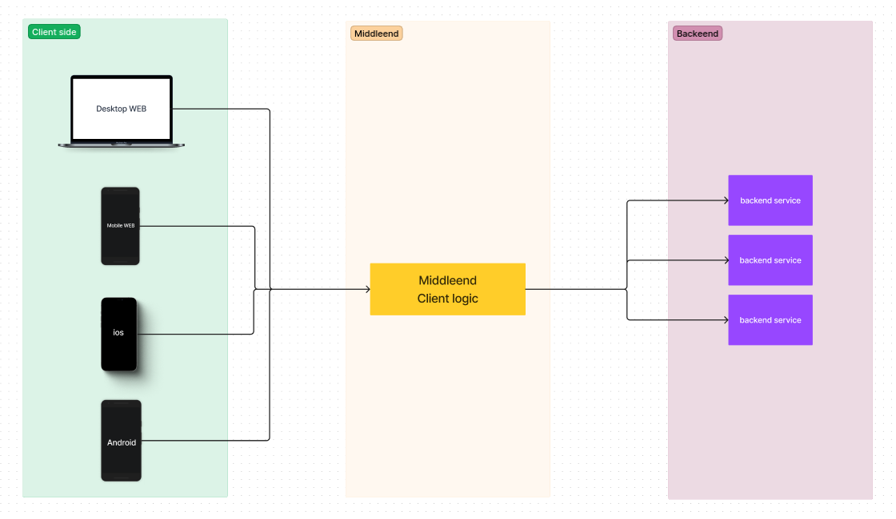
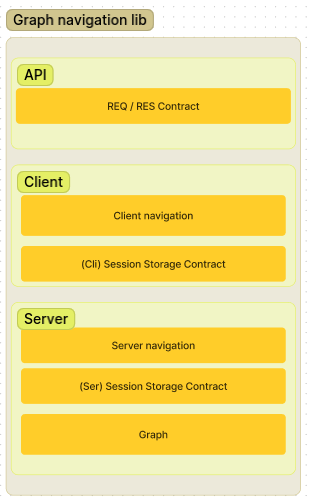

# Graph navigationJS

## Introduction
GraphNavigationJS is a library that allows us to set up an middleeend architecture for our client-server applications.
In this case, we see the implementation of the library to create a middleend that will be consumed by a web desktop version, a web mobile version, and an Android mobile version. We can see from the wordings on the first screen how the middleend can handle different versions for each type of client.

## Rest architecture vs Middleend architecture

### Rest
In a classic rest architecture the client device is responsible for the UI and in greater or lesser extent is responsible for the client logic. At the same time these devices consume the backend resource trought an rest api.

conceptual schema

devices ecosystem example

### Middleend
In a middleend architecture the client devices are just encharged of show the UI, a pure frontend application. In this case there are a intermedial layer between the pure frontend and pure backend; it this layer (middleend) will found the client logic.

conceptual schema

devices ecosystem example

## Middleend architecture advantages

+ Client logic in one poit: The goodness of hav the client logic in a single point is that if you have more than one device that reprecentan the same product, at te time of add or fix client funcionalities, you just has to touch in one place.
+ Repeat code: If you have more than one device that repressent the same product, you dontt have to replicate this code in each device application.
+ Light client applications: a the same time, the client device applications became a light pure frontend applications.
+ One entry point to your network: in this architecture the client just consume one endpoint dedacated to return the UI to be interpreted by the client. So yo just has one entry point instead multiple backend applications. A the same time, the middleend consumes your backend applications that are probably hosted in the same network; become a safety network.

# Library content

The library is compossed by three parts. 
+ API: encharged of the interface between client and middleend applications.
+ Client: Encharged of manage the client navigation.
+ Server: Encharged of build the steps graph and manage the server navigation.

Library content

